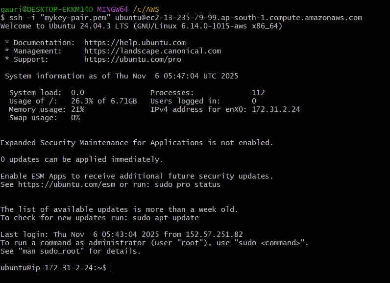
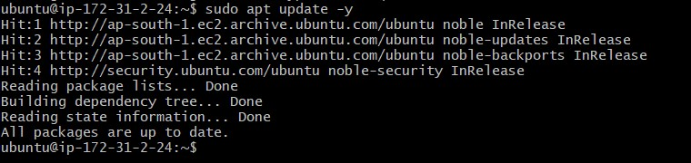
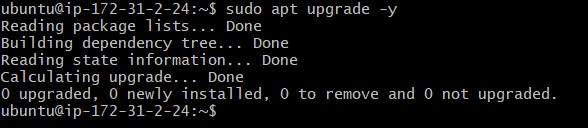
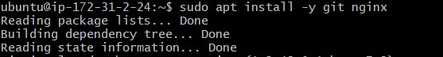
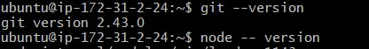
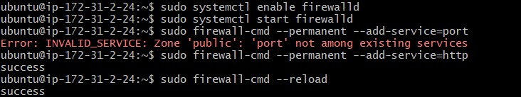
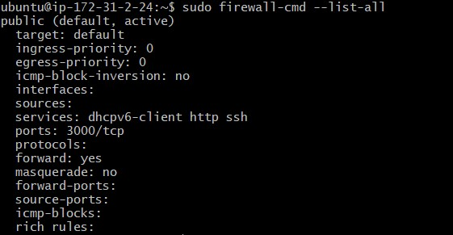
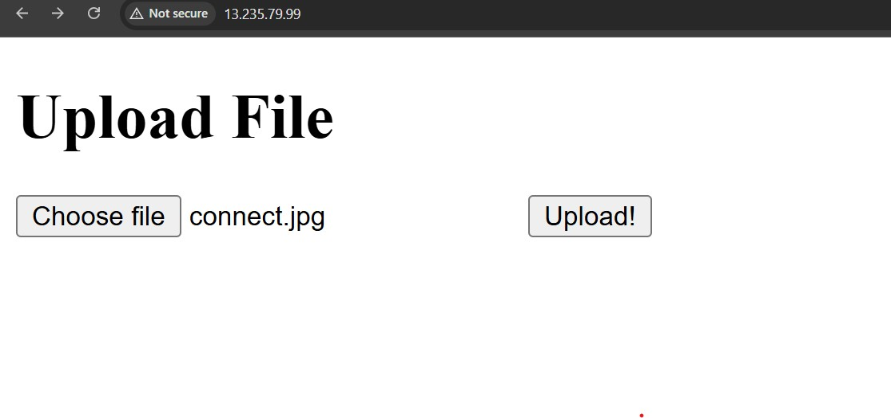

# 🚀 Deploy a Web Application on AWS EC2

## 🧰 Prerequisites
- Launched EC2 instance  
- **AMI:** Ubuntu  
- **Created Key Pair**  
- **Created Security Group**

---

## 🪄 Step 1: Launch EC2 Instance

1. Choose **Ubuntu AMI**  
2. Select an instance type (e.g., `t2.micro`)  
3. Add **Key Pair**  
4. Create a **Security Group** with inbound rules:  
   - SSH → Port 22  
   - HTTP → Port 80  
5. Launch the instance  

📸 **Security Group Screenshot:**  

---

Step 2: Connect to the EC2 Instance

Use your key pair to SSH into the instance:

ssh -i "MY-KEY.pem" ec2-user@ec2-43-204-148-151.ap-south-1.compute.amazonaws.com

---

Step 3: Install Packages and Dependencies

1️⃣ Update and upgrade the system

sudo apt update -y
sudo apt upgrade -y

2️⃣ Install Node.js

curl -fsSL https://deb.nodesource.com/setup_18.x | sudo -E bash -
sudo apt install -y nodejs

3️⃣ Install Git and Nginx

sudo apt install -y git nginx

4️⃣ Check installations

git --version
node --version

---

Step 4: Deploy Your Application

git clone https://github.com/gauridighe347/Deploy-Web-AWS-Ec2.git
cd Deploy-Webapp-Aws-Ec2
project has dependencies, install them

npm install

---

Step 5: Add Firewall Rules

1️⃣ Install firewalld

sudo yum install -y firewalld
2️⃣ Enable and start the firewall service

sudo systemctl enable firewalld
sudo systemctl start firewalld

3️⃣ Allow HTTP (port 80) and HTTPS (port 443)

sudo firewall-cmd --permanent --add-service=http

4️⃣ Reload firewall to apply changes

sudo firewall-cmd --reload

---

Step 6: Set Up Reverse Proxy Using Nginx

Edit the Nginx configuration: 

sudo nano /etc/nginx/nginx.conf

Add this block inside the http block

server {
    listen 80;
    server_name your-ec2-public-ip;

    location / {
        proxy_pass http://localhost:3000;
        proxy_set_header Host $host;
        proxy_set_header X-Real-IP $remote_addr;
    }
}
restart nginx

sudo systemctl restart nginx
sudo systemctl enable nginx
sudo systemctl status nginx

---

Step 7: Start Your Application

node index.js
---

Step 8: Access Your Application

http://<your-ec2-public-ip>

 
