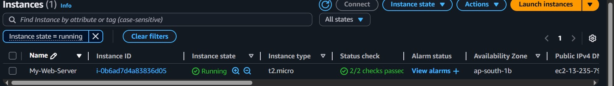

# 🚀 Manual Deployment of Web Application on AWS EC2  

This project demonstrates how to **manually deploy a Node.js web application** on an **AWS EC2 Ubuntu instance**.  
It includes setup steps, firewall configuration, and verification screenshots.

---

## 🖥️ Project Overview  

The objective of this project is to manually deploy a simple Node.js application on an Ubuntu EC2 instance.  
It covers steps like system setup, package installation, firewall configuration, and running the app.

---

## ⚙️ Steps Followed  

---

### 🟢 Step 1: Launch an EC2 Instance  
- Choose **Ubuntu** as the OS  
- Configure security group (allow SSH, HTTP)  
- Connect to instance using `.pem` key  

📸 **Screenshots:**  

  


---

### 🟢 Step 2: Update & Upgrade Packages  
```bash
sudo apt update && sudo apt upgrade -ysudo ufw enable


